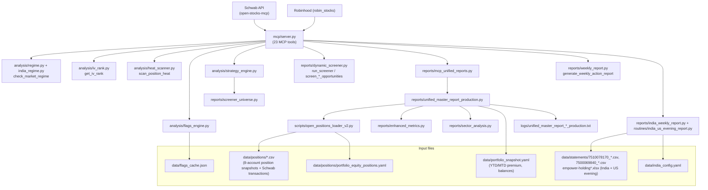

# Theta-Lab — Architecture & Script Map

> Generated 2026-06-29 by static analysis of the codebase. Purpose: show what each
> script does, what input files it needs and from where, and where scripts overlap or
> duplicate each other.

## TL;DR — the single most important thing

There are **two completely separate report engines** that both claim to produce the
"unified master report", and they use **different code, different loaders, and partly
different input directories**:

| | LIVE path (MCP) | LEGACY path (CLI) |
|---|---|---|
| Entry | MCP tool `generate_unified_master_report` (via `mcp/server.py`) | `python3 scripts/unified_master_report.py all` (the command in the old skill) |
| Engine | `mcp/reports/unified_master_report_production.py` (1672 ln) | `scripts/unified_master_report.py` (483 ln) |
| Loader | `scripts/open_positions_loader_v2.py` | `scripts/data_loader_final.py` |
| Reads | `data/positions/*.csv` + `data/portfolio_snapshot.yaml` | `data/positions/*` + `data/statements/*` + snapshot |
| Output | `logs/..._{type}_production.txt` | `logs/..._{type}_production.txt` (same names!) |

**They overwrite each other's output files.** Prefer the LIVE/MCP path now that the
MCP server works; treat the CLI engine as legacy. (See "Cleanup recommendations".)

---

## Live MCP data flow (what the skill actually uses today)



---

## Input files — who reads what

| Input file / dir | Read by | Notes |
|---|---|---|
| `data/positions/*-Positions-*.csv` (Schwab/Fidelity position snapshots) | `open_positions_loader_v2` (LIVE), `data_loader_final`, `data_loader` | Per-account current holdings + open options |
| `data/positions/*_Transactions_*.csv` (Schwab transactions) | `open_positions_loader_v2`, `analysis_closed_pnl`, `reconstruct_positions_from_transactions` | Realized P&L / net positions |
| `data/positions/robinhood-*.csv`, `hood-*.csv` | `open_positions_loader_v2`, `data_loader_final` | Robinhood accounts |
| `data/positions/*Vanguard*.csv` | `open_positions_loader_v2`, `data_loader_final` | Vanguard |
| `data/positions/portfolio_equity_positions.yaml` | `open_positions_loader_v2` | Manual equity overrides |
| `data/portfolio_snapshot.yaml` | `unified_master_report_production` (LIVE), `scripts/unified_master_report`, `weekly_dashboard` | YTD/MTD premium, balances; **written by** `scripts/update_snapshot.py` |
| `data/statements/*` (Schwab positions, Empower transactions, Robinhood UUID csvs) | `scripts/update_snapshot.py`, `data_loader`, `generate_all_reports` | Source for the snapshot file |
| `data/statements/7510078170_*.csv` (ICICI F&O), `7500069840_*.csv` (ICICI equity), `empower-holding*.xlsx` | `routines/india_us_evening_report.py`, `analysis/india_statement_parser.py` | India + US evening report |
| `data/india_config.yaml` | India routines/reports | Core portfolio + exit triggers |
| `data/flags_cache.json` | `analysis/flags_engine.py` | Per-flag TTL cache; seeded from `screener_universe.py` |
| `data/regime_history.json` | `scripts/citadel_regime_detector.py` | Standalone regime history |
| `data/portfolio/*.xlsx` (Portfolio-1, Holdings, 10-Year) | `scripts/screener_loader.py` | Watchlist universes |
| `~/.tokens/schwab_token*.json` | `mcp/schwab_client.py`, `scripts/schwab_auth.py` | OAuth tokens (A/B/C) |
| `.claude.json` | `mcp/bootstrap.py` | Loads Schwab secrets at MCP startup |

⚠️ **`data/positions/` and `data/statements/` overlap.** The same Schwab transaction
exports (e.g. `Individual_XXX232_Transactions_*.csv`) exist in **both** directories. The
live loader reads `positions/`; the snapshot generator reads `statements/`. Keeping both
in sync by hand is error-prone — see cleanup notes.

---

## Script catalog

### Live MCP server stack (`mcp/`) — KEEP
| File | Role |
|---|---|
| `mcp/server.py` | 23 MCP tools; orchestrates everything |
| `mcp/bootstrap.py` | Loads Schwab creds from `.claude.json` |
| `mcp/config.py` | Persona guardrails, account params |
| `mcp/schwab_client.py` / `robinhood_client.py` / `breeze_client.py` | Broker wrappers (Schwab / Robinhood / ICICI) |
| `mcp/analysis/regime.py`, `india_regime.py` | Regime detection |
| `mcp/analysis/iv_rank.py` | IV rank/percentile |
| `mcp/analysis/heat_scanner.py` | Position heat matrix |
| `mcp/analysis/flags_engine.py` | Dynamic risk flags (+ `flags_cache.json`) |
| `mcp/analysis/strategy_engine.py` | Per-symbol trade rec (needs `screener_universe`) |
| `mcp/analysis/pnl.py`, `metrics.py` | P&L + dashboard metrics |
| `mcp/analysis/india_statement_parser.py` | ICICI CSV parser |
| `mcp/analysis/macro_risk_analyzer.py` | Crash early-warning |
| `mcp/models/{kelly,ev_model,monte_carlo,vix_regime}.py` | Sizing / probability models |
| `mcp/reports/mcp_unified_reports.py` → `unified_master_report_production.py` | **Live report engine** |
| `mcp/reports/enhanced_metrics.py`, `sector_analysis.py` | Metrics + sector for production report |
| `mcp/reports/dynamic_screener.py`, `screener_universe.py` | New-entry screening + universe data |
| `mcp/reports/weekly_report.py`, `weekly_combined_report.py`, `india_weekly_report.py`, `bimonthly_technical_report.py`, `monthly_objectives_report.py` | Report variants exposed as MCP tools |
| `mcp/reports/report_utils.py` | Shared report helpers (reads positions + snapshot) |
| `mcp/routines/india_us_evening_report.py`, `unified_reports_scheduler.py`, `weekly_dashboard.py`, `email_report.py` | Scheduled/automation routines |

### `scripts/` used by the live path or as current CLI — KEEP
| File | Role | Status |
|---|---|---|
| `scripts/open_positions_loader_v2.py` | **The loader the live MCP report uses** | LIVE (via sys.path inject) |
| `scripts/enhanced_metrics`* / `sector_analysis`* | (these live in `mcp/reports/`, imported via sys.path) | LIVE |
| `scripts/update_snapshot.py` | Builds `portfolio_snapshot.yaml` from `data/statements/` | CLI — run weekly |
| `scripts/schwab_auth.py` | One-time Schwab OAuth setup | Keep (setup util) |
| `scripts/data_loader_final.py` | Loader for the CLI report engine | CLI/legacy |
| `scripts/unified_master_report.py` | Legacy CLI closed-loop report engine | LEGACY (superseded by MCP) |
| `scripts/screener_loader.py` | Reads Portfolio xlsx watchlists | CLI |
| `scripts/thesis_state_tracker.py`, `master_framework_engine.py`, `hedge_fund_framework.py`, `greeks_calculator.py`, `citadel_regime_detector.py`, `yahoo_price_fetcher.py` | Support the legacy CLI engine | CLI/legacy |

### Used by the CLI 4-type report engine — KEEP (verified via import closure)
`scripts/unified_master_report.py` imports these directly; they build the
daily / weekly / bi-weekly / monthly reports with their 8+ sections across all accounts:
`data_loader_final.py`, `screener_loader.py`, `greeks_calculator.py`,
`thesis_state_tracker.py`, `hedge_fund_framework.py`, `master_framework_engine.py`,
plus transitively `data_loader.py`, `greeks_calculator_from_market.py`, `yahoo_price_fetcher.py`.

### Essential standalone producers — KEEP (not imported, but required)
- `scripts/update_snapshot.py` — **writes** `data/portfolio_snapshot.yaml` that every report reads.
- `scripts/schwab_auth.py` — one-time Schwab OAuth token setup.

### Genuinely NOT in any report pipeline (closure-verified)
Standalone analysis tools (run by hand, nothing imports them, not in report flow):
`analyze_sector_data.py`, `attribution_tracker.py`, `citadel_regime_detector.py`,
`pnl_calculator.py`, `position_decision_analyzer.py`, `risk_budget_calculator.py`,
`stress_tester.py`, `trade_recommendation_engine.py`, `analysis_closed_pnl.py`,
`example_usage.py`, `analysis/persona_analyzer.py`.

Legacy / superseded (dead — hardcode old May-11 filenames or old broker naming):
`data_loader_may11.py`, `data_loader_may11_v2.py`, `open_positions_loader.py` (v1),
`data_schema_validator.py`, `extract_clean_symbols.py`,
`reconstruct_positions_from_transactions.py`.

> Correction note: an earlier draft mislabeled several CLI-engine scripts (and `data_loader.py`)
> as orphans by measuring only the live MCP path. The lists above are verified by full
> transitive import closure from all report entry points.

---

## Duplication / overlap findings

1. **5 data loaders, 2 of them current.**
   - Current: `open_positions_loader_v2.py` (live MCP), `data_loader_final.py` (CLI).
   - Superseded/dead: `data_loader.py`, `data_loader_may11.py`, `data_loader_may11_v2.py`, `open_positions_loader.py` (v1). The `*_may11*` and v1 loaders hardcode May-11 filenames / `Robinhood_Account1` naming that no longer matches current exports.

2. **6 report engines** (4 active + archive): `unified_master_report_production.py` (live),
   `mcp/reports/unified_master_report.py` (older "summary"), `mcp_unified_reports.py` (thin MCP wrapper),
   `scripts/unified_master_report.py` (legacy CLI), `generate_all_reports.py` (test harness),
   plus `mcp/reports.archive/unified_master_report{,_v2,_8accounts,_detailed,_backup}.py`.

3. **Input directory overlap:** `data/positions/` vs `data/statements/` hold overlapping
   transaction CSVs read by different code paths. No single source of truth.

4. **Two skill files:** `skills/options-trader/SKILL.md` (the real skill) and
   `skills/options_trader.md` (older, references `update_snapshot`). The latter is stale.

5. **`mcp/reports.archive/`** is a full duplicate tree of older report modules. 9 of them
   were recently restored into `mcp/reports/` to fix the server import error — confirm
   their data is current, then the archive can be deleted.

---

## Cleanup recommendations (safe order)

1. **Pick one report engine.** Standardize on the MCP `generate_*` tools. Mark
   `scripts/unified_master_report.py` and `generate_all_reports.py` as legacy (or move to `scripts/legacy/`).
2. **Pick one loader.** Keep `open_positions_loader_v2.py`; delete the `*_may11*` and v1 loaders.
3. **Pick one input dir.** Decide `data/positions/` = current snapshots, `data/statements/` =
   raw broker exports for snapshot building — and stop cross-duplicating transaction files.
4. **Delete `mcp/reports.archive/`** once restored modules are confirmed current.
5. **Delete the stale `skills/options_trader.md`** (keep `skills/options-trader/SKILL.md`).
6. **Move standalone orphans** to `scripts/tools/` so the active pipeline is obvious.
```
